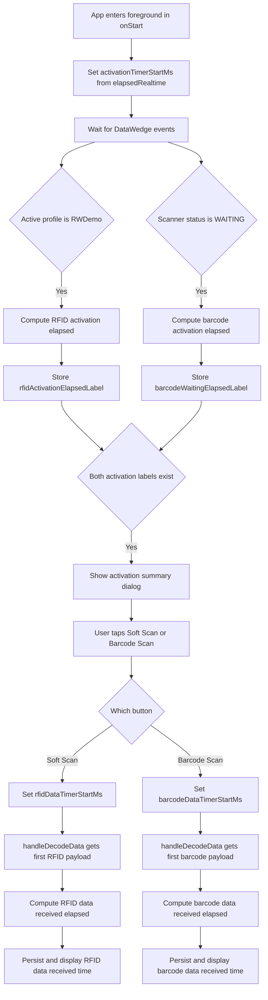

# DataWedge Time Measurement Methodology

This document describes how Activation Time and Data Received Time are measured for both RFID and barcode workflows in the application.

## Quick Validation

1. **Monotonic Timing**: Using `SystemClock.elapsedRealtime()` is the correct choice. It keeps measurements immune to system clock jumps (e.g., NTP synchronization events) and captures true elapsed duration, including deep sleep time.
2. **Activation Logic**: Measuring from `onStart()` is robust because it captures elapsed time from initial UI visibility to DataWedge profile and hardware readiness.
3. **State Mapping**:
    - **RFID**: Uses `RESULT_GET_ACTIVE_PROFILE` and checks for the `"RWDemo"` profile.
    - **Barcode**: Uses the `WAITING` scanner status, which is the most accurate indicator that scanner hardware is powered and ready.
4. **Trigger-to-Data Latency**: Resetting the timer on the button `onClick` event and stopping it at the first `handleDecodeData` event provides a clear user-perceived response metric.

## 1. Activation Time (App Startup to Hardware Ready)

Activation Time measures the delay between the application entering the foreground and the DataWedge hardware (RFID sled and barcode scanner) reaching a ready state.

### Measurement Flow
1. **Baseline (T0)**: The measurement starts in the `onStart()` lifecycle method of `RWDemoActivity` using `SystemClock.elapsedRealtime()`.
    - *Code:* `activationTimerStartMs = SystemClock.elapsedRealtime();`
2. **RFID Activation**: The time is recorded when the application receives a DataWedge broadcast confirming that the `"RWDemo"` profile is now active.
    - *Condition:* `RESULT_GET_ACTIVE_PROFILE` extra matches `"RWDemo"`.
    - *Calculation:* `Elapsed = CurrentTime - activationTimerStartMs`
3. **Barcode Activation**: The time is recorded when the application receives a DataWedge status notification indicating the scanner is in the `"WAITING"` state.
    - *Condition:* `RESULT_SCANNER_STATUS` extra equals `"WAITING"`.
    - *Calculation:* `Elapsed = CurrentTime - activationTimerStartMs`

### Summary Dialog
Once both hardware components report a ready state for the first time after startup, an Activation Time Summary dialog is shown with precise millisecond values.

---

## 2. Data Received Time (Trigger to First Data)

Data Received Time measures latency from user interaction (tapping a scan button) to the first captured data returned via intent.

### Measurement Flow
1. **Trigger Point**: The measurement starts immediately when the user clicks the "Soft Scan" (RFID) or "Barcode Scan" button.
    - *RFID Code:* `rfidDataTimerStartMs = SystemClock.elapsedRealtime();`
    - *Barcode Code:* `barcodeDataTimerStartMs = SystemClock.elapsedRealtime();`
2. **Data Capture**: The time is recorded in `handleDecodeData` when the first valid payload arrives for that specific source.
    - *RFID Condition:* First occurrence where `source` is RFID and payload is non-empty.
    - *Barcode Condition:* First occurrence where `source` is `scanner` and payload is non-empty.
3. **Calculation**:
    - `Data Latency = CurrentTime - TriggerPoint`

---

## 3. Implementation Details

- **Precision**: All measurements use `SystemClock.elapsedRealtime()`, which provides a monotonic clock that includes sleep time, making it ideal for interval timing.
- **Display Format**: Times are formatted as `S.mmm` seconds (e.g., `1.234s`).
- **Reset Logic**:
    - Activation timers reset on every `onStart()`.
    - Data latency timers reset every time a new scan is initiated via the UI buttons.

## 4. Why These Metrics Matter
- **Activation Time** helps identify delays in DataWedge profile switching or hardware initialization (e.g., Bluetooth handshake for RFID sleds).
- **Data Received Time** quantifies scanning responsiveness from a user perspective.

---

## 5. Detailed Code Snippets and Measurement Flow

The snippets below are aligned with the current implementation in `RWDemoActivity`.

### 5.1 Timer Fields

```java
private long activationTimerStartMs = -1L;
private long rfidDataTimerStartMs = -1L;
private long barcodeDataTimerStartMs = -1L;

private String rfidActivationElapsedLabel;
private String barcodeWaitingElapsedLabel;
private String rfidDataReceivedElapsedLabel;
private String barcodeDataReceivedElapsedLabel;
```

### 5.2 Activation Baseline Set in `onStart()`

```java
@Override
protected void onStart() {
    super.onStart();

    activationTimerStartMs = SystemClock.elapsedRealtime();
    rfidActivationTimeReported = false;
    barcodeWaitingTimeReported = false;
    activationSummaryDialogShown = false;

    rfidActivationElapsedLabel = null;
    barcodeWaitingElapsedLabel = null;

    rfidDataTimerStartMs = -1L;
    rfidDataReceivedElapsedLabel = null;
    barcodeDataTimerStartMs = -1L;
    barcodeDataReceivedElapsedLabel = null;
}
```

### 5.3 Data Timer Start on User Trigger

```java
softScanTrigger.setOnClickListener(v -> {
    if (!rfidScanState) {
        clearData();
        rfidDataTimerStartMs = SystemClock.elapsedRealtime();
        rfidDataReceivedElapsedLabel = null;
    }
    toggleSoftRfidTrigger();
});

barcodeScanTrigger.setOnClickListener(v -> {
    if (!barcodeScanState) {
        clearData();
        barcodeDataTimerStartMs = SystemClock.elapsedRealtime();
        barcodeDataReceivedElapsedLabel = null;
    }
    toggleSoftBarcodeTrigger();
});
```

### 5.4 Activation Time Capture from DataWedge Status

```java
if (intent.hasExtra(RESULT_GET_ACTIVE_PROFILE)) {
    String activeProfile = intent.getStringExtra(RESULT_GET_ACTIVE_PROFILE);
    if (BUNDLE_EXTRA_PROFILE_NAME_VAL.equals(activeProfile)) {
        if (!rfidActivationTimeReported && activationTimerStartMs > 0) {
            long elapsedMs = SystemClock.elapsedRealtime() - activationTimerStartMs;
            rfidActivationElapsedLabel = formatElapsedLabel(elapsedMs);
            rfidActivationTimeReported = true;
            maybeShowActivationSummaryDialog();
        }
    }
}

if (intent.hasExtra(RESULT_SCANNER_STATUS)) {
    String status = intent.getStringExtra(RESULT_SCANNER_STATUS);
    if (STATUS_WAITING.equalsIgnoreCase(status)
            && !barcodeWaitingTimeReported
            && activationTimerStartMs > 0) {
        long elapsedMs = SystemClock.elapsedRealtime() - activationTimerStartMs;
        barcodeWaitingElapsedLabel = formatElapsedLabel(elapsedMs);
        barcodeWaitingTimeReported = true;
        maybeShowActivationSummaryDialog();
    }
}
```

### 5.5 Data Received Time Capture in `handleDecodeData`

```java
if (data != null && !data.isEmpty()) {
    boolean isBarcodeSource = DataWedgeSupport.SOURCE_SCANNER.equalsIgnoreCase(source);

    if (!isBarcodeSource && rfidDataTimerStartMs > 0 && rfidDataReceivedElapsedLabel == null) {
        long elapsedMs = SystemClock.elapsedRealtime() - rfidDataTimerStartMs;
        rfidDataReceivedElapsedLabel = formatElapsedLabel(elapsedMs);
    }

    if (isBarcodeSource && barcodeDataTimerStartMs > 0 && barcodeDataReceivedElapsedLabel == null) {
        long elapsedMs = SystemClock.elapsedRealtime() - barcodeDataTimerStartMs;
        barcodeDataReceivedElapsedLabel = formatElapsedLabel(elapsedMs);
    }
}
```

### 5.6 End-to-End Measurement Flowchart



### 5.7 Timing Visualization


